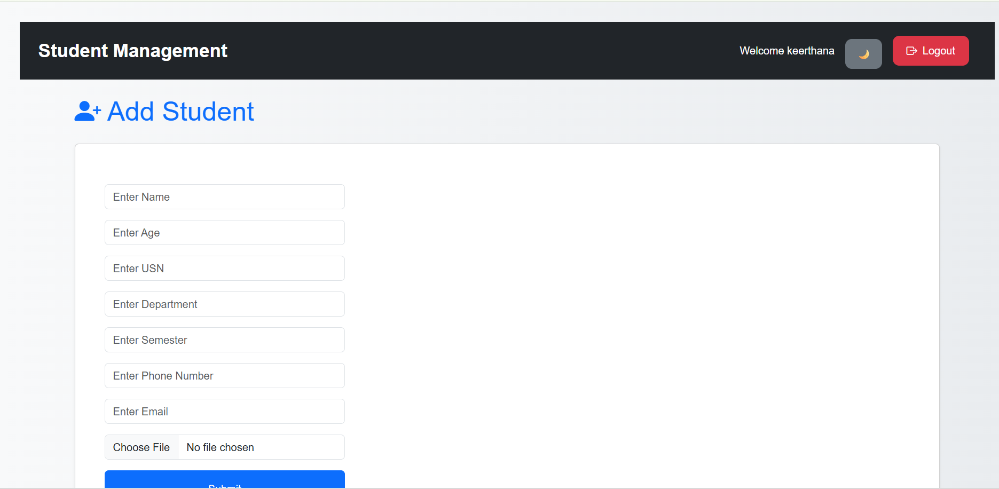
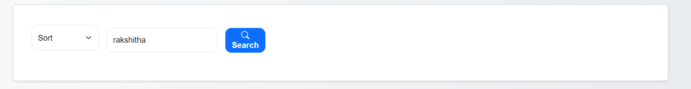
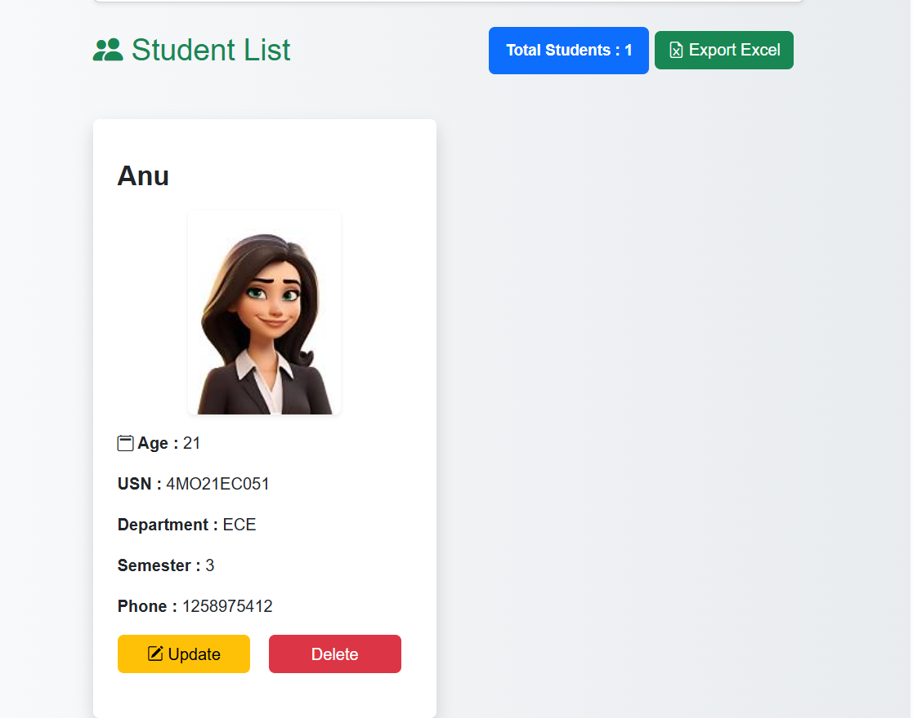
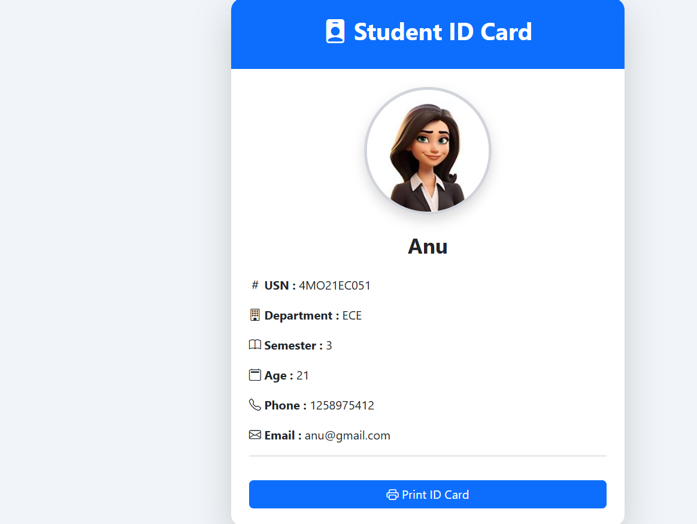
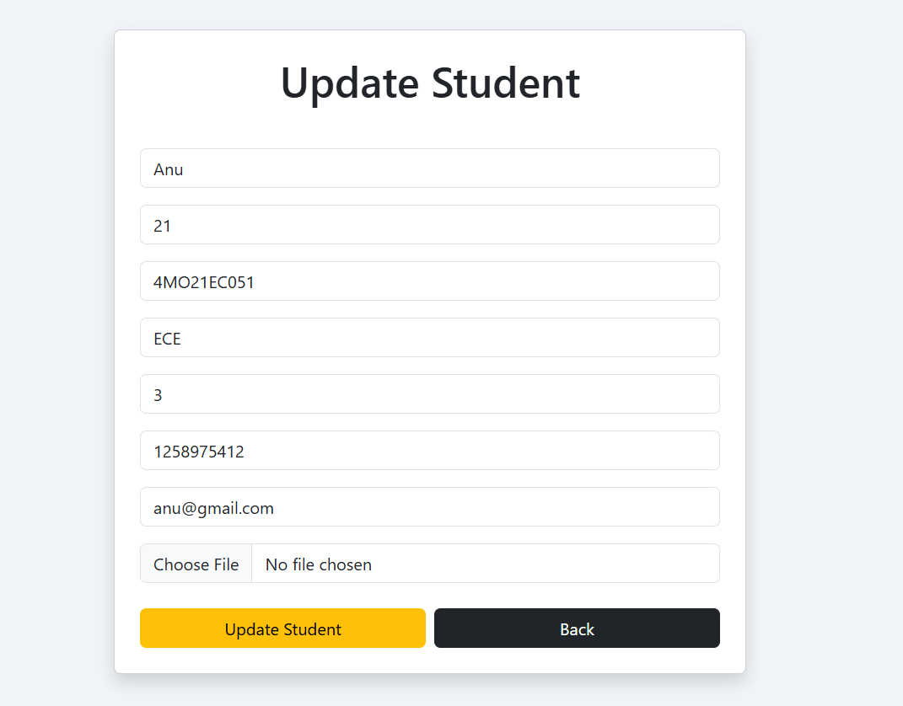
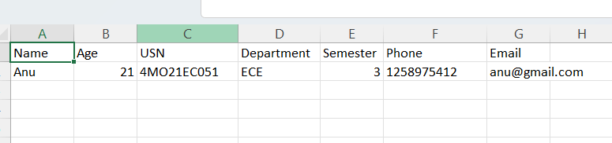

# Student Management System

A professional Django-based Student Management System with authentication, dark mode, student ID cards, validation, Excel export, and responsive dashboard UI.

---

## Features

- User Authentication (Login/Register/Logout)
- Add, Update, Delete Students
- Search and Sort Students
- Pagination
- Dark Mode
- Student ID Card
- Print ID Card / Save as PDF
- Excel Export
- Responsive UI
- Form Validation
- Student Image Upload

---

## Technologies Used

- Python
- Django
- Bootstrap 5
- HTML
- CSS
- JavaScript
- SQLite3
- OpenPyXL

---

## Installation

1. Clone repository

```bash
git clone YOUR_GITHUB_LINK

```

2. Open project folder

```bash
cd mysite
```

3. Install requirements

```bash
pip install -r requirements.txt
```

4. Run migrations

```bash
python manage.py migrate
```

5. Start server

```bash
python manage.py runserver
```

---

## Project Screenshots

### Dashboard



### Search and Sort



### Student Form



### Student ID Card



### Update Page



### Excel Export



---

## Developed By

Keerthana